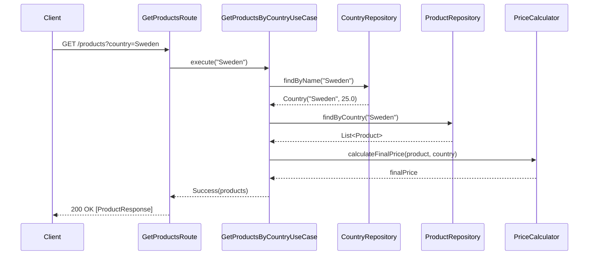
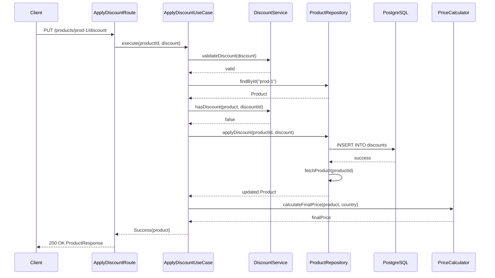
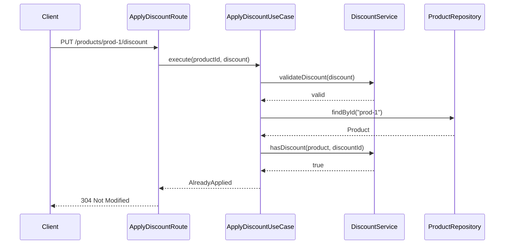
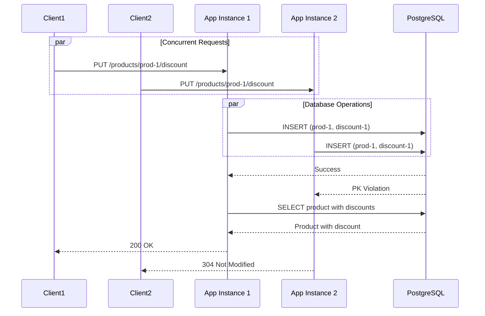

# Architecture Documentation

## Design Overview

I implemented this service using **Hexagonal Architecture** (Ports and Adapters) to ensure clean separation of concerns and maintainability. The architecture follows OpenAPI-driven development principles.

### Layer Structure

The codebase is organized into four distinct layers:

**1. Domain Layer** (`domain/`)

Domain models are pure data classes without any business logic:
- `Product`, `Discount`, `Country` - Simple data containers
- `PriceCalculator` - Handles all price calculations with VAT and discounts
- `DiscountService` - Manages discount operations and validation
- Repository interfaces (`ProductRepository`, `CountryRepository`) - Define contracts without implementation details

**2. Use Case Layer** (`usecase/`)

Use cases orchestrate business operations:
- `GetProductsByCountryUseCase` - Retrieves products with country validation
- `ApplyDiscountUseCase` - Applies discounts with built-in idempotency checks

**3. Infrastructure Layer** (`infrastructure/`)

Concrete adapters for external systems:
- `ProductRepositoryImpl` - Database operations with a shared `fetchProduct` method to avoid duplication
- `CountryRepositoryImpl` - Country and VAT data access
- Separate route files (`GetProductsRoute`, `ApplyDiscountRoute`) - Each endpoint has its own file
- `Dtos` - Maps between domain models and generated API models

**4. Generated Layer** (`build/generated/`)

OpenAPI Generator auto-generates DTOs from the spec:
- `ProductResponse`, `ApplyDiscountRequest`, `Discount`, `Error`
- Generated at build time from `app/src/main/resources/openapi.yaml`

### Design Principles

- **Anemic Domain Models** - Data separated from behavior
- **Domain Services** - Business logic encapsulated in stateless services
- **Single Responsibility** - Each file has one clear purpose
- **Dependency Inversion** - Use cases depend on interfaces, not concrete implementations
- **Configuration Externalization** - All settings in `application.conf`
- **Code Generation** - DTOs generated from OpenAPI spec to maintain consistency

## Request Flow

### Get Products by Country



### Apply Discount (First Time)



### Apply Discount (Idempotent - Already Applied)



### Concurrent Discount Application



## Concurrency Solution

### The Challenge

Multiple clients must not apply the same discount to a product twice, even under heavy concurrent load.

### Approach: Database-Level Concurrency Control

Idempotency is enforced at the database level using a composite primary key:

```sql
PRIMARY KEY (product_id, discount_id)
```

### How It Works

1. Multiple requests try to insert the same discount simultaneously
2. PostgreSQL's MVCC allows only one INSERT to succeed
3. Other transactions get a primary key violation
4. The application catches this exception and returns 304 Not Modified
5. No application-level locking needed

### Benefits

- **True Concurrency** - No locks blocking other operations
- **Scalability** - Works across multiple application instances
- **Simplicity** - The database handles the complexity
- **Reliability** - ACID guarantees prevent race conditions
- **Efficiency** - No separate unique index needed

## Database Schema

Three tables form the data model:

```sql
CREATE TABLE countries (
    name VARCHAR(50) PRIMARY KEY,
    vat_percent DOUBLE PRECISION NOT NULL
);

CREATE TABLE products (
    id VARCHAR(255) PRIMARY KEY,
    name VARCHAR(255) NOT NULL,
    base_price DOUBLE PRECISION NOT NULL,
    country VARCHAR(50) NOT NULL REFERENCES countries(name)
);

CREATE TABLE discounts (
    product_id VARCHAR(255) NOT NULL REFERENCES products(id),
    discount_id VARCHAR(255) NOT NULL,
    percent DOUBLE PRECISION NOT NULL,
    PRIMARY KEY (product_id, discount_id)
);
```

The composite primary key on `(product_id, discount_id)` is the foundation of the concurrency strategy.

### VAT Configuration

VAT rates are externalized to the database instead of hardcoded:
- Sweden: 25%
- Germany: 19%
- France: 20%

Adding new countries is straightforward:
```sql
INSERT INTO countries (name, vat_percent) VALUES ('Spain', 21.0);
```

## API Documentation

Swagger UI provides interactive API documentation:
- **Swagger UI**: http://localhost:8082/swagger
- **OpenAPI JSON**: http://localhost:8082/openapi

The spec file location is configurable via `openapi.swaggerFile` in `application.conf`.

## Technology Stack

Selected technologies:

- **Exposed** - Type-safe SQL without ORM overhead
- **PostgreSQL** - ACID guarantees for concurrency control
- **HikariCP** - High-performance connection pooling
- **OpenAPI Generator** - Automated code generation
- **MockK** - Kotlin-friendly mocking for tests

## Testing Strategy

Comprehensive unit tests without database dependencies:

**Domain Services**
- `PriceCalculatorTest` - Price calculations with VAT and discounts
- `DiscountServiceTest` - Discount validation and operations

**Use Cases**
- `ApplyDiscountUseCaseTest` - Discount application logic with mocked repository
- `GetProductsByCountryUseCaseTest` - Product retrieval with country validation

**Idempotency**
- `DiscountIdempotencyTest` - Simulates concurrent requests to verify only one succeeds

All tests use MockK for mocking, ensuring fast execution without external dependencies.

## Configuration Management

All configuration externalized to `application.conf`:

```hocon
ktor.deployment.port = 8082  # Override with PORT
openapi.swaggerFile = "openapi.yaml"  # Override with OPENAPI_SPEC_FILE
database.url = "jdbc:postgresql://..."  # Override with DB_URL
database.user = "discount_user"  # Override with DB_USER
database.password = "discount_pass"  # Override with DB_PASSWORD
database.maxPoolSize = 10  # Override with DB_MAX_POOL_SIZE
```

## Build and Deployment

The build process generates code and creates a fat JAR:

```bash
./gradlew openApiGenerate  # Generate models from spec
./gradlew build  # Includes code generation
docker-compose up --build  # Build and run in Docker
```

The Dockerfile creates a self-contained fat JAR with all dependencies for easy deployment.

## Scalability Considerations

The service is designed to scale horizontally:

1. **Stateless Design** - No session state, instances are independent
2. **Connection Pooling** - HikariCP efficiently manages database connections
3. **Async I/O** - Ktor's coroutines handle high concurrency
4. **Database-Level Idempotency** - Works across multiple instances
5. **Composite Primary Key** - Fast lookups and constraint enforcement
